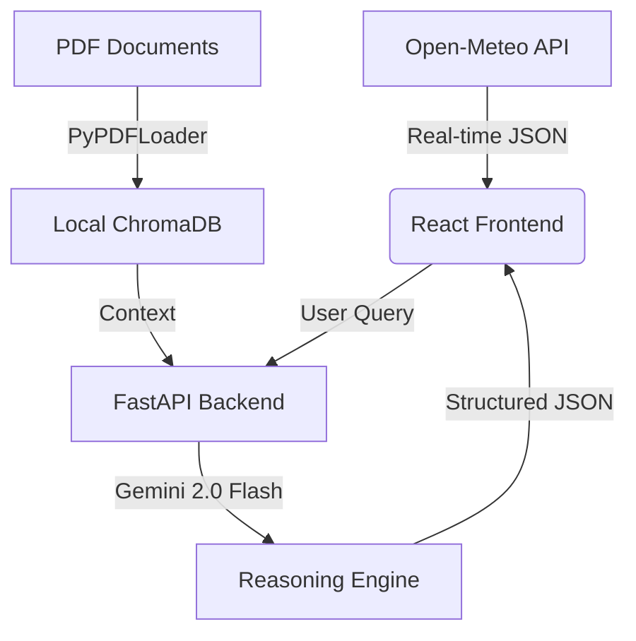

# Resilience.OS: Interoperable AI Climate Platform for G7 Nations

> **"From Data to Action: An Open-Source, Privacy-First AI Contribution to the G7"**

Resilience.OS is a jurisdiction-agnostic, AI-driven intelligence platform designed to operationalize climate data for public servants across G7 nations. It integrates **Real-time Telemetry (Open-Meteo)** with **Local RAG Inference** to provide secure, explainable policy insights.

---

## 📺 Project Demo
Watch the full demonstration of Resilience.OS in action.

---

## 🌍 Key Technical Innovations

### 1. Privacy-First "Local" RAG Architecture Unlike typical AI wrappers, Resilience.OS prioritizes Data Sovereignty.
* **Local Embeddings:** We use `HuggingFaceEmbeddings (all-MiniLM-L6-v2)` running locally. Your sensitive government documents are vectorized on-premise, **never sent to external APIs** for embedding.
* **Vector Store:** Uses `ChromaDB` for high-performance, local document retrieval.

### 2. Neuro-Symbolic "Chain of Thought" Engine
The system does not just "guess". As seen in `backend/main.py`, we utilize a **Structured Prompting** technique that forces the AI to output a JSON Logic Chain:
1.  **Data Observation:** Ingests live data from `Open-Meteo API`.
2.  **Policy Lookup:** Semantic search via ChromaDB.
3.  **Inference & Conclusion:** Synthesizes facts into actions.

### 3. Real-Time G7 Data Interoperability
The frontend (`App.jsx`) is connected to the **Open-Meteo Historical & Forecast API**.
* Fetches live Soil Moisture, Solar Radiation, and Wind Gusts based on coordinates (Toronto, Berlin, Paris).
* Demonstrates instant adaptability to different G7 geolocations without manual reconfiguration.

---

## 📸 System Features

### Unified Command Center
Integrates live sensor data visualization with AI analysis.
> **[Insert Dashboard Screenshot Here]**

### AI Strategic Briefing (Reasoning Chain)
Displays the step-by-step logic and mandatory **Micro-Citations** linking back to specific PDF pages (e.g., "Canada Emission Reduction Plan, p.59").
> **[Insert Reasoning Chain Screenshot Here]**

### Dynamic Policy Library
A "No-Code" knowledge base. Public servants can simply drop PDF files into the `/data` folder. The system auto-tags them by Country (Canada/Germany/France) and Category (Agri/Energy) based on filenames.
> **[Insert Library Screenshot Here]**

---

## ⚙️ Tech Stack & Architecture

Resilience.OS acts as a non-intrusive intelligent overlay.

Frontend: React.js, Tailwind CSS, Lucide Icons, Recharts

Backend: Python FastAPI, Uvicorn

AI & RAG: LangChain, Google Gemini 2.0 Flash, ChromaDB

Embeddings: HuggingFace all-MiniLM-L6-v2 (Local execution)

Data Source: Open-Meteo API (Weather/Soil/Marine data)

🚀 Getting Started (Run Locally)
This repository contains the full source code submitted to the G7 GovAI Grand Challenge.

Prerequisites

Python 3.9+

Node.js 18+

Google Gemini API Key

1. Backend Setup (FastAPI)

Bash
cd backend
pip install -r requirements.txt
# Add your PDF documents to the /data folder
# Create .env file with GOOGLE_API_KEY
python main.py
# Server runs at [http://0.0.0.0:8000](http://0.0.0.0:8000)
2. Frontend Setup (React)

Bash
cd frontend
npm install
npm run dev
# App runs at http://localhost:5173
🛡️ Security & Data Protection
No External Training: Documents are processed via RAG (Retrieval-Augmented Generation) and are not used to train the base LLM.

On-Premise Embeddings: Vectorization happens locally, ensuring document contents do not leave the secure perimeter during the indexing phase.

🤝 Contribution

This project is a non-profit contribution by VisualClimate.org. License: MIT License - Free for any G7 nation to fork and deploy.

